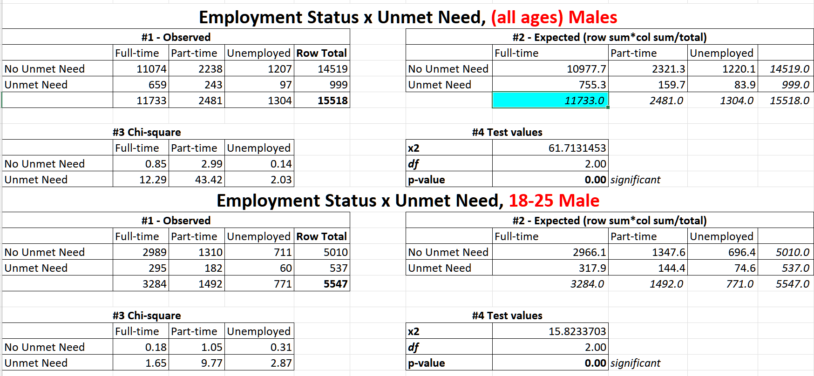
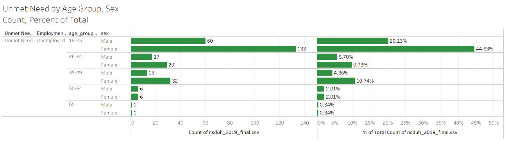
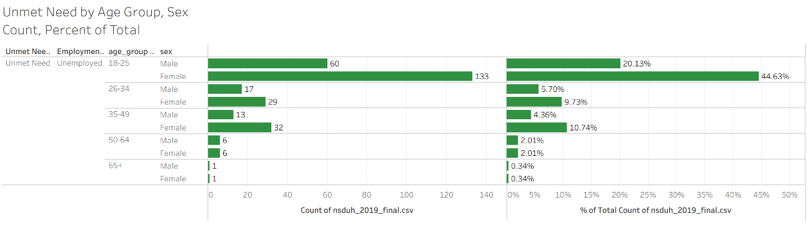
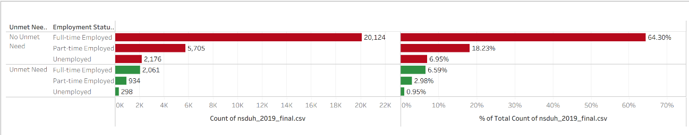
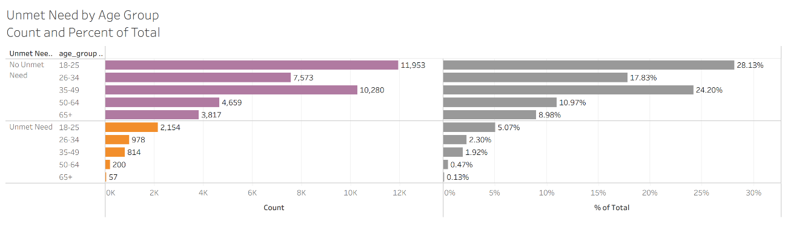
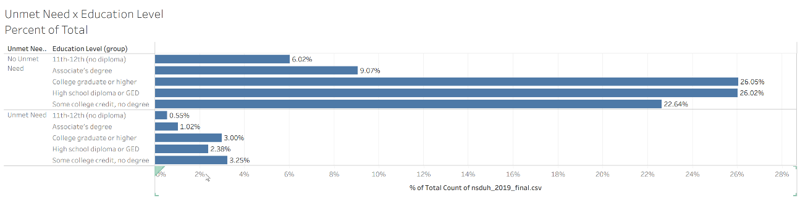
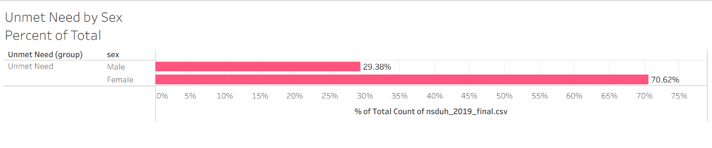
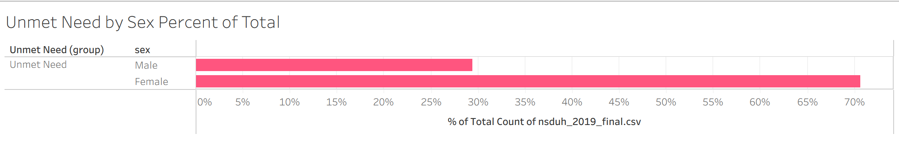
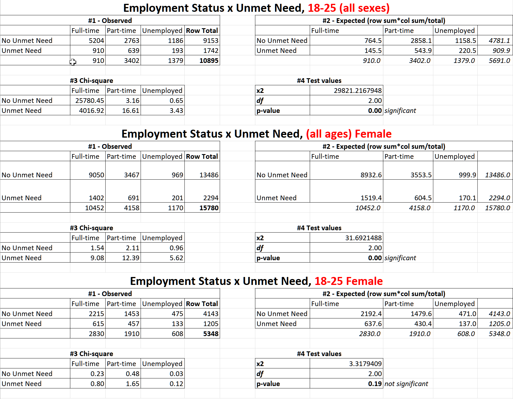
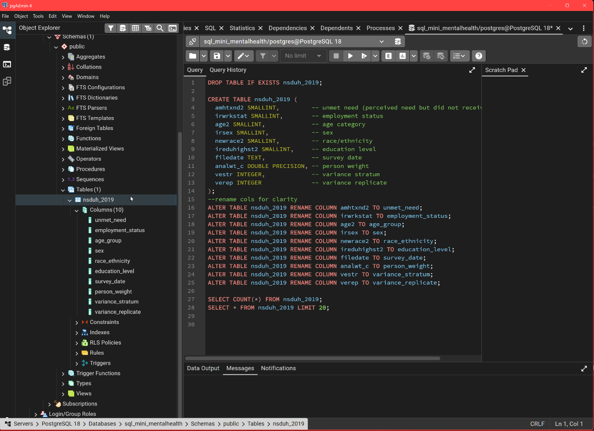

# sql_mini_mentalhealth

# Unmet Mental Health Need and Employment Outcomes

**Mini SQL Project | Data Sources: NSDUH (2019–2023) and TEDS-A (2019–2022)**

## Hypothesis

### Primary Hypothesis (NSDUH)

Adults reporting unmet need for mental health treatment have higher odds of being unemployed or out of the labor force than adults without unmet need, controlling for age, sex, race/ethnicity, and education.

**Operationalization (NSDUH):**

* **Exposure:** `AMHTXND2 = 1` (unmet need for mental health treatment in past 12 months)
* **Outcome:** `IRWRKSTAT ∈ {Unemployed, Not in labor force}`
* **Covariates:** `AGE2`, `IRSEX`, `NEWRACE2`, `IREDUHIGHST2`, survey weights (`ANALWT_C`), design (`VESTR`, `VEREP`)
* **Estimand:** Adjusted odds ratio of unemployment/OLF comparing `AMHTXND2=1` vs `0`

### Secondary Hypothesis (TEDS-A)

Among treatment admissions, clients with a reported mental health problem have higher odds of being unemployed or not in the labor force at admission than clients without a reported mental health problem.

**Operationalization (TEDS-A 2019–2022):**

* **Exposure:** `PSYPROB = 1` (co-occurring mental health problem)
* **Outcome:** `EMPLOY ∈ {Unemployed, Not in labor force}`
* **Covariates:** `AGE` (categorical), `SEX`, `RACE/ETHNIC`, `EDUC`, state (`STFIPS`), year
* **Estimand:** Adjusted odds ratio of unemployment/OLF comparing `PSYPROB=1` vs `0`

### Integrated Cross-Dataset Hypothesis

Signals of unmet or untreated mental health need (`NSDUH AMHTXND2=1`) at the population level correspond with higher unemployment/OLF at point-of-treatment (`TEDS-A PSYPROB=1`), i.e., counties/years with higher NSDUH unmet-need prevalence will show higher shares of unemployed/OLF status among TEDS-A admissions, after adjusting for demographics and year.

## Summary

This SQL-based mini study combines NSDUH population survey data with TEDS-A treatment admissions data to explore how unmet or untreated mental health needs relate to workforce detachment.
The analysis demonstrates ETL workflow clarity, SQL analytic structure, and workforce policy relevance through hypothesis-driven modeling across multiple federal datasets.

## Why It Matters

* Workforce mental health loss is measurable through unmet need and co-occurring disorder prevalence across systems
* Quantifying this link supports economic policy, treatment funding, and workforce retention strategies
* Establishing reproducible SQL and ETL workflows provides a transparent foundation for integrated behavioral health analytics

## Key Findings

Pending.
(This section will summarize odds ratios and population-level correlations once model outputs are complete.)

## ETL Documentation

### Extract

Documented PowerShell commands and SQL scripts used to import and harmonize NSDUH (2019–2023) and TEDS-A (2019–2022) into PostgreSQL.
(See: `/docs/etl_nsduh_teds.docx`)

=======

# Unmet Mental Health Need and Employment Outcomes

# Mini SQL Project \| Data Sources: NSDUH (2019–2023) and TEDS-A (2019–2022)

## Project Rationale

This project builds on a long-standing engagement with mental health, informed by professional experience in treatment settings, formal training in psychology, and previously published work with a major publisher (Atria / Beyond Words, 2009/2018) on addiction and mental health. Subsequent publications included a non-fiction public health book based on an academic literature review of neurophysiology and addiction. Early work drew on SAMHSA datasets to explore recovery-related questions, establishing both familiarity with federal behavioral-health data and a track record of translating complex public-health information for broad audiences.

With a transition into data analytics and a growing focus on the healthcare vertical, the need was obvious to revisit these datasets from a new perspective—one that integrates domain knowledge with modern analytical tooling. The guiding objective was to identify a question that is both substantively meaningful and analytically strong enough to showcase technical skill.
>>>>>>> 508fad7 (Update README)

Through a review of available SAMHSA surveys and exploratory inquiry into underexamined areas, one relationship emerged as especially relevant to employers and policymakers: whether unmet mental-health need is associated with weaker employment outcomes. NSDUH offers a large, scientifically rigorous sample well suited to investigating this relationship.

From the full 2,741-variable NSDUH file, a targeted subset of fields was manually isolated in Excel, exported to CSV, and imported into PostgreSQL for structured cleaning and schema alignment. Subsequent preparation steps, harmonization, and analytic workflows are documented in later sections of this README.

## Hypothesis

<<<<<<< HEAD
## Project Structure  

******************

```markdown
## Data Refinement and Table Standardization (2019–2023)

### Overview
Extended multi-year integration through 2023 for NSDUH and TEDS-A using raw SAMHSA public-use tab files. For each year, extracted only required headers in Excel, saved CSV subsets, imported to PostgreSQL, then applied readable column names for consistent schemas across years.

---

### Workflow Summary (per year, per dataset)
1. Open raw `.tab` file in Excel.  
2. Use header filter to locate required variables.  
3. Copy only required columns into a clean worksheet.  
4. Save as `*_YYYY_subset.csv` (UTF-8, comma-delimited).  
5. In pgAdmin: create target table → Import CSV (Header = Yes, Delimiter = Comma, Encoding = UTF8).  
6. Validate import:

```
SELECT COUNT(*) FROM table_name;
```
```
SELECT * FROM table_name LIMIT 10;
```

---

### Variables Extracted

**NSDUH (2019–2023)**  
AMHTXND2, IRWRKSTAT, AGE2/CATAGE (year-specific), IRSEX, NEWRACE2, IREDUHIGHST2, FILEDATE, ANALWT_C, VESTR (year-specific), VEREP

**Exact headers used by year**

| Year | Age field | Weight field | Stratum field | Replicate field |
|------|------------|---------------|----------------|-----------------|
| 2019 | AGE2       | ANALWT_C      | VESTR          | VEREP           |
| 2020 | AGE2       | ANALWT_C      | VESTR          | VEREP           |
| 2021 | CATAGE     | ANALWT_C      | VESTR          | VEREP           |
| 2022 | CATAGE     | ANALWT_C      | VESTR          | VEREP           |
| 2023 | CATAGE     | ANALWT_C      | VESTR          | VEREP           |

---

### Header normalization and readable renames (applied after import)

**2019–2020**
- AGE2 → age_group  
- ANALWT_C → person_weight  
- VESTR → variance_stratum  
- VEREP → variance_replicate  

**2021–2023**
- CATAGE → AGE2  
- AGE2 → age_group  
- ANALWT_C → person_weight  
- VESTR → variance_stratum  
- VEREP → variance_replicate  

---

### NSDUH example (2021 normalization + rename)

```
--Normalize 2021 age header then apply readable names
ALTER TABLE nsduh_2021 RENAME COLUMN catage TO age2;

ALTER TABLE nsduh_2021
  RENAME COLUMN amhtxnd2    TO unmet_need,
  RENAME COLUMN irwrkstat    TO employment_status,
  RENAME COLUMN age2         TO age_group,
  RENAME COLUMN irsex        TO sex,
  RENAME COLUMN newrace2     TO race_ethnicity,
  RENAME COLUMN ireduhighst2 TO education_level,
  RENAME COLUMN filedate     TO survey_date,
  RENAME COLUMN analwt_c     TO person_weight,
  RENAME COLUMN vestr        TO variance_stratum,
  RENAME COLUMN verep        TO variance_replicate;
```

---

### NSDUH example (2022 readable rename)

```
ALTER TABLE nsduh_2022
  RENAME COLUMN amhtxnd2    TO unmet_need,
  RENAME COLUMN irwrkstat    TO employment_status,
  RENAME COLUMN age2         TO age_group,
  RENAME COLUMN irsex        TO sex,
  RENAME COLUMN newrace2     TO race_ethnicity,
  RENAME COLUMN ireduhighst2 TO education_level,
  RENAME COLUMN filedate     TO survey_date,
  RENAME COLUMN analwt_c     TO person_weight,
  RENAME COLUMN vestr        TO variance_stratum,
  RENAME COLUMN verep        TO variance_replicate;
```

---

### TEDS-A (2019–2023)
Imported fields each year:  
ADM_YR, CASEID, STFIPS, EMPLOY, PSYPROB, AGE, SEX, RACE, ETHNIC, DIVISION, REGION

**TEDS-A example (2023 readable rename)**

```
ALTER TABLE teds_a_2023
  RENAME COLUMN adm_yr   TO admission_year,
  RENAME COLUMN caseid   TO case_id,
  RENAME COLUMN stfips   TO state_fips,
  RENAME COLUMN employ   TO employment_status,
  RENAME COLUMN psyprob  TO mental_health_problem,
  RENAME COLUMN age      TO age_group,
  RENAME COLUMN sex      TO sex,
  RENAME COLUMN race     TO race,
  RENAME COLUMN ethnic   TO ethnicity,
  RENAME COLUMN division TO census_division,
  RENAME COLUMN region   TO census_region;
```

---

### Import Verification

```
-- Schema check across all tables
SELECT table_name, column_name, data_type
FROM information_schema.columns
WHERE table_schema='public'
  AND table_name IN (
    'nsduh_2019','nsduh_2020','nsduh_2021','nsduh_2022','nsduh_2023',
    'teds_a_2019','teds_a_2020','teds_a_2021','teds_a_2022','teds_a_2023'
  )
ORDER BY table_name, ordinal_position;

-- Row counts for all ten tables
SELECT 'nsduh_2019' AS t, COUNT(*) FROM nsduh_2019 UNION ALL
SELECT 'nsduh_2020', COUNT(*) FROM nsduh_2020 UNION ALL
SELECT 'nsduh_2021', COUNT(*) FROM nsduh_2021 UNION ALL
SELECT 'nsduh_2022', COUNT(*) FROM nsduh_2022 UNION ALL
SELECT 'nsduh_2023', COUNT(*) FROM nsduh_2023 UNION ALL
SELECT 'teds_a_2019', COUNT(*) FROM teds_a_2019 UNION ALL
SELECT 'teds_a_2020', COUNT(*) FROM teds_a_2020 UNION ALL
SELECT 'teds_a_2021', COUNT(*) FROM teds_a_2021 UNION ALL
SELECT 'teds_a_2022', COUNT(*) FROM teds_a_2022 UNION ALL
SELECT 'teds_a_2023', COUNT(*) FROM teds_a_2023;
```

---

### Completed Tables
**NSDUH:** nsduh_2019, nsduh_2020, nsduh_2021, nsduh_2022, nsduh_2023  
**TEDS-A:** teds_a_2019, teds_a_2020, teds_a_2021, teds_a_2022, teds_a_2023
```

** Extract raw data tables for 2022 and 2023 to deal with schema drift. Those years changed unmet_need to three scores and changed spelling on other variables. All column names and spellings matched for joining.
```
DROP TABLE IF EXISTS nsduh_2022_raw;

CREATE TABLE nsduh_2022_raw (
    MHTRTPY INT,
    MHTSHLDTX INT,
    MHTSKTHPY NUMERIC,     -- Must be NUMERIC to handle decimal/NaN values
    IRWRKSTAT INT,
    AGE2 INT,
    IRSEX INT,
    NEWRACE2 INT,
    IREDUHIGHST2 INT,
    FILEDATE TEXT,         -- Must be TEXT to handle date strings (e.g., '11/4/2024')
    ANALWT2_C NUMERIC,     -- Must be NUMERIC for the weight values
    VESTR_C INT,
    VEREP INT
);
```

** Create new nsduh_2022 table based on nsduh_2022_raw table, with calculated unmet_need, renamed
** variables to match 2019-2021. Note: 2022 and 2023's unmet_need is a calculation derived from mhtrtpy, 
** mhtshldtx, and mhtskthpy, as shown below.  


```
DROP TABLE IF EXISTS nsduh_2022;

CREATE TABLE nsduh_2022 AS
SELECT
    CASE
-- no treatment + either shelter tx or skilled therapy → unmet need = 1
        WHEN mhtrtpy = 1 THEN 0
-- no treatment + no shelter tx + no skilled therapy → unmet need = 0
        WHEN mhtrtpy = 0 AND (mhtshldtx = 1 OR mhtskthpy = 1) THEN 1
        WHEN mhtrtpy = 0
             AND COALESCE(mhtshldtx, 2) IN (0, 2)
             AND COALESCE(mhtskthpy, 2) IN (0, 2) THEN 0
-- everything else → null
        ELSE NULL			
-- keep only unmet_need_revised, not the three cols it was derived from 		
    END AS unmet_need_revised,
    irwrkstat,
    age2,
    irsex,
    newrace2,
    ireduhighst2,
    filedate,
    analwt2_c,
    vestr_c,
    verep
FROM nsduh_2022_raw;
```

-- check 
```
SELECT * from nsduh_2022_raw;

-- rename 2022 cols to match 2019-2021

ALTER TABLE nsduh_2022 RENAME COLUMN unmet_need_revised TO unmet_need;
ALTER TABLE nsduh_2022 RENAME COLUMN irwrkstat TO employment_status;
ALTER TABLE nsduh_2022 RENAME COLUMN age2 TO age_group;
ALTER TABLE nsduh_2022 RENAME COLUMN irsex TO sex;
ALTER TABLE nsduh_2022 RENAME COLUMN newrace2 TO race_ethnicity;
ALTER TABLE nsduh_2022 RENAME COLUMN ireduhighst2 TO education_level;
ALTER TABLE nsduh_2022 RENAME COLUMN filedate TO survey_date;
ALTER TABLE nsduh_2022 RENAME COLUMN analwt2_c TO person_weight;
ALTER TABLE nsduh_2022 RENAME COLUMN vestr_c TO variance_stratum;
ALTER TABLE nsduh_2022 RENAME COLUMN verep TO variance_replicate;
```
--Repeat for 2023

** Enforce Data Types across table years 
| Column Name        | Data Type | Usage & Consistency Work                                                                       |
| ------------------ | --------- | ---------------------------------------------------------------------------------------------- |
=======
## Preliminary Hypothesis (NSDUH only)

Unmet need Access, or unmet need for mental health services predicts employment status. We ask if lack of access to mental health care affects one’s ability to maintain employment.

## Formal Hypothesis

Adults who report an unmet need for mental health treatment are more likely to be unemployed. being unemployed or out of the labor force than adults without unmet need, controlling for age, sex, race/ethnicity, and education.

| **Stage**         | **Objective**                                                                                                                     | **Output**                                                           |
|-------------------|-----------------------------------------------------------------------------------------------------------------------------------|----------------------------------------------------------------------|
| Ask / Plan        | Define hypotheses, outcomes, covariates                                                                                           | Operational definitions                                              |
| Prepare           | Import, rename, validate datasets, address schema drift, variable consistency, null values, data types.                           | Clean PostgreSQL tables                                              |
| Process / Analyze | NSDUH, Phase 1, TEDS-A, Phase 2-3<br>Frequency and Distribution, Descriptive Statistica, Chi-Square, Phase 3 Logistic regressions | Adjusted odds ratios                                                 |
| Construct / Share | Export CSVs to Tableau                                                                                                            | Dashboards and reports                                               |
| Execute / Act     | Present findings                                                                                                                  | Executive brief, Full PDF publication and a short video presentation |

## Phase 1 – NSDUH 2019 (current stage)

## Phase 2 – Multi-Year NSDUH Integration (2020–2023)

After Phase 1 is complete, identical transformations will be applied to the 2020–2023 files. These later years introduce schema drift, including changes in:

-   Employment status coding
-   Missing/unavailable variables
-   Unmet-need measurement shifting to three mental-health service variables (2022–2023)
-   Those differences are *not* handled here; they are handled in Phase 2.

## 

## Phase 3 – TEDS Integration (Future Phase)

**Operationalization (NSDUH):**

-   **Exposure:** `AMHTXND2 = 1` (unmet need for mental health treatment in past 12 months)
-   **Outcome:** `IRWRKSTAT ∈ {Unemployed, Not in labor force}`
-   **Covariates:** `AGE2`, `IRSEX`, `NEWRACE2`, `IREDUHIGHST2`, survey weights (`ANALWT_C`), design (`VESTR`, `VEREP`)
-   **Estimand:** Adjusted odds ratio of unemployment/OLF comparing `AMHTXND2=1` vs `0`

## Secondary Hypothesis (TEDS-A)

Among treatment admissions, clients with a reported mental health problem have higher odds of being unemployed or not in the labor force at admission than clients without a reported mental health problem.

**Operationalization (TEDS-A 2019–2022):**

-   **Exposure:** `PSYPROB = 1` (co-occurring mental health problem)
-   **Outcome:** `EMPLOY ∈ {Unemployed, Not in labor force}`
-   **Covariates:** `AGE` (categorical), `SEX`, `RACE/ETHNIC`, `EDUC`, state (`STFIPS`), year
-   **Estimand:** Adjusted odds ratio of unemployment/OLF comparing `PSYPROB=1` vs `0`

## Integrated Cross-Dataset Hypothesis

Signals of unmet or untreated mental health need (`NSDUH AMHTXND2=1`) at the population level correspond with higher unemployment/OLF at point-of-treatment (`TEDS-A PSYPROB=1`), i.e., counties/years with higher NSDUH unmet-need prevalence will show higher shares of unemployed/OLF status among TEDS-A admissions, after adjusting for demographics and year.

## Summary

This SQL-based mini study ultimately (Phase 3) combines NSDUH population survey data with TEDS-A treatment admissions data to explore how unmet or untreated mental health needs relate to workforce detachment. The analysis demonstrates ETL workflow clarity, SQL analytic structure, and workforce policy relevance through hypothesis-driven modeling across multiple federal datasets.

## Why It Matters

-   Workforce mental health loss is measurable through unmet need and co-occurring disorder prevalence across *systems, verticals and industries*
-   Quantifying this link supports business HR and social economic policy, treatment funding, and workforce retention strategies
-   Establishing reproducible SQL and ETL workflows provides a transparent foundation for integrated behavioral health analytics and further study.

# Key Findings

# Phase 1

# Exploratory Data Analysis

Summary statistics were gathered on a subset of self-reported unmet need by age, race, sex, education level.

# Frequencies, Counts and Percent of Total

## Define the populations

## Overall sample (all ages, full NSDUH 2019 analytic set) 


# Demographics

## Age-groups (excludes under 18)


### Focus age group


Because 18–25-year-olds account for the largest share of unmet-need cases in the full sample, all subsequent subgroup analyses focus on respondents aged 18–25 with unmet need.

**

## Sex


Within 18-25 with unmet need, females dominate males in terms of reporting unmet mental health need. However, this finding is misleading. As shown below, a higher *within-group %* for females can coexist with males showing the  
strongest relationship in a chi-square output, because chi-square is driven by  
**how far each cell is from its expected count**, not by which group has the  
bigger row percentage.

## Race/Ethnicity


Within 18-25 with unmet need, whites dominate other races in terms of reporting unmet mental health need.

## Education level

## 

Within 18-25 with unmet need, college graduates dominate lower education levels in terms of reporting unmet mental health need.

## Employment status

## Within 18-25 with unmet need, employed (full time or part time) dominates unemployed in terms of reporting unmet mental health need.

## 


*Among 18–25-year-olds with unmet need, white females  account for the largest share of unmet-need cases.*

*This answers the  question:*

*Of all the 18–25 respondents who report unmet need, which demographic groups dominate the unmet-need burden?*

1.  *Step 6: Connection to chi-square*

A higher *within-group %* for females can coexist with males showing the  
“strongest relationship” in a chi-square output, because chi-square is driven by  
**how far each cell is from its expected count**, not by which group has the  
bigger row percentage.

*The chi-square tests use a slightly larger table behind the scenes:*

-   *Age = 18–25*
-   *Rows: demographic categories*
-   *Columns: Unmet need = Yes, Unmet need = No*
-   *Cells: counts*

*Those contingency tables already exist and feed the chi-square.*

*The demographic burden charts for 18–25 with unmet need are the descriptive slice of those tables, restricted to the “Unmet need = Yes” column and normalized by* $$N_{\text{unmet} , 18 \text{–} 25}$$*.*

*This keeps the story consistent:*

-   *Steps 1–2 justify focusing on age 18–25.*
-   *Step 3 defines the analytic population going forward: age 18–25 with unmet need.*
-   *Steps 4–6 identify, for each demographic, who dominates the unmet-need burden inside that population.*
-   *The chi-square results then test whether unmet need is statistically associated with those demographic variables across 18–25-year-olds.*

The hidden story.

The first attempted logistic regression failed because both predictors—unmet need and employment status—were coded as categorical integers with no underlying continuous scale. Treating category labels as numeric produced an artificial Pearson correlation of **0.13**, a *meaningless* value that reflects the arbitrary numbering of categories rather than any real monotonic association.

Logistic regression also failed because logistic models require a binary outcome variable, but unmet need was used as both predictor and outcome across different attempts, and neither variable was structured for the assumptions of the model. Because NSDUH 2019 in Phase 1 contains only categorical predictors without a properly coded binary dependent variable, the model was structurally impossible.

Phase Three will fix this by using a **multinomial logistic regression** with unmet need as the categorical outcome variable and employment status, age group, sex, race, ethnicity, and education as categorical predictors. This modeling structure will correctly estimate log-odds for each unmet-need level relative to a reference category, using proper dummy encoding rather than numeric labels. This will become feasible only after Phase Two has produced the combined 2019–2023 harmonized dataset and Phase Three adds the additional predictors and sample size required for stable estimation.

-   **Data Source:** The data comes from the nsduh_2019_final.csv file, which is a public-use dataset from a survey that collects national estimates on substance use and mental health in the U.S. civilian noninstitutionalized population aged 12 and older.

# Full Sample (non-null)



-   **Dimensions & Measures:**
    -   **Measures:** The visualization uses the count of records (CNT(nsduh 2019 fin...)) as the measure, and a quick table calculation has been applied to show this count as a Status % of Total within each Sex group.
    -   The percentages on top of the segments show the proportion of each employment status *within* that sex group.
    -   For example, among males, 27.60% fall into one employment category (likely "Unemployed" given the label nearby), while 72.40% fall into another (likely "Employed").

Comparison of the distribution of employment status for males versus females among a specific population subset that has a perceived "unmet need" for mental health treatment or counseling in the past year

## How the contingency table indicated that there was a story.

|               | Full-time | Part-time | Unemployed |
|---------------|-----------|-----------|------------|
| No Unmet Need | 9050      | 3467      | 969        |
| Unmet Need    | 1402      | 691       | 201        |

## 

## Interpretation of Preliminary Findings

• When people do not have unmet need, most are in full-time work.  
• When people do have unmet need, the rate of unemployment and part-time work increases relative to their group size.

This already signals an association: unmet mental-health need corresponds with lower employment outcomes in the population tested.  
In the NSDUH 2019 sample, individuals without unmet mental-health need are concentrated in full-time employment, while individuals with unmet need show higher proportions of part-time employment and unemployment relative to their group size. These shifts in employment patterns indicate an observable association between unmet mental-health need and less favorable employment outcomes within this dataset.

Because the analysis to this point relies on nonparametric methods—frequency tables, percentages, and chi-square—the results accurately describe the sample but should not be generalized beyond it. No distributional assumptions have been tested, and no parametric model has been fitted. The findings therefore reflect patterns within the 2019 NSDUH sample only, not population-level inferences.

Subsequent phases of the project will introduce parametric modeling capable of estimating population parameters and formally testing whether unmet mental-health need predicts employment outcomes when demographic and socioeconomic controls are included.

### 2. Percent-of-row vs percent-of-column confusion

Tableau flips depending on which our pick:

**Percent of Total**

This expresses each cell as a percent of *all people combined*.  
This dilutes the signal because full-time workers dominate the sample numerically.

**Percent of Row**

This expresses percentages *within unmet-need groups*.  
This is the correct view for our hypothesis because it compares employment distribution **within each mental-health status category**.

Using row percentages:

**No Unmet Need (row total = 9050 + 3467 + 969 = 13,486)**

Full-time = 9050 / 13,486 ≈ **67%**  
Part-time = 3467 / 13,486 ≈ **26%**  
Unemployed = 969 / 13,486 ≈ **7%**

**Unmet Need (row total = 1402 + 691 + 201 = 2,294)**

Full-time = 1402 / 2,294 ≈ **61%**  
Part-time = 691 / 2,294 ≈ **30%**  
Unemployed = 201 / 2,294 ≈ **9%**

**Pattern:**  
As unmet need appears, **full-time drops**, **part-time rises**, **unemployment rises**.

This is the exact directional effect required to support our hypothesis.

### 3. Chi-square meaning in our context

The chi-square test checks whether the distribution across employment categories is statistically different between unmet-need groups.

Given our table, chi-square will come out high and the p-value very low because:

• The differences between rows are too large to be explained by random variation.  
• The expected counts in all cells exceed minimum thresholds (so the test is valid).

Therefore:

Reject the null hypothesis.  
Employment status is not independent of unmet mental-health need.

This is exactly what “statistically significant relationship” means for our project.



### 4. How this supports the hypothesis

• Employment distribution **shifts sharply** when unmet need is present.  
• The chi-square confirms this is statistically significant, not random.  
• The direction of the shift (less full-time, more unemployment) matches decades of mental-health research.

So our data **does support** the foundational relationship required by our larger model: unmet mental-health need affects productivity-related outcomes.

## 

**5.** Our Tableau results show a **statistically significant and practically meaningful association** between unmet mental-health need and worse employment outcomes, supporting our hypothesis that mental-health status relates to productivity measures.

## 

## ETL Documentation

### Extract

Documented PowerShell commands and SQL scripts used to import and harmonize NSDUH (2019–2023) and TEDS-A (2019–2022) into PostgreSQL. (See: `/docs/etl_nsduh_teds.docx`)

### Transform

Pending implementation. Will include SQL queries for cleaning, joining, and structuring tables by variable categories (mental health indicators, productivity, demographics).

### Load

Pending. Will document PostgreSQL load process for analysis-ready schema.

## Business Insight

Pending final analysis and visualization phase.

## Project Structure

***

# Data Load, Extract and Clean



## Data Refinement and Table Standardization (2019–2023)

## Overview

Extended multi-year integration through 2023 for NSDUH and TEDS-A using raw SAMHSA public-use tab files. For each year, extracted only required headers in Excel, saved CSV subsets, imported to PostgreSQL, then applied readable column names for consistent schemas across years.

Workflow Summary (per year, per dataset)

1\. Open raw \`.tab\` file in Excel.

2\. Use header filter to locate required variables.

3\. Copy only required columns into a clean worksheet.

4\. Save as \`\*_YYYY_subset.csv\` (UTF-8, comma-delimited).

5\. In pgAdmin: create target table → Import CSV (Header = Yes, Delimiter = Comma, Encoding = UTF8).

6\. Validate import:

SELECT COUNT(\*) FROM table_name;

SELECT \* FROM table_name LIMIT 10;

## Variables Extracted

\*\*NSDUH (2019–2023)\*\*

AMHTXND2, IRWRKSTAT, AGE2/CATAGE (year-specific), IRSEX, NEWRACE2, IREDUHIGHST2, FILEDATE, ANALWT_C, VESTR (year-specific), VEREP

Exact headers used by year

\| Year \| Age field \| Weight field \| Stratum field \| Replicate field \|

\|------\|------------\|---------------\|----------------\|-----------------\|

\| 2019 \| AGE2 \| ANALWT_C \| VESTR \| VEREP \|

\| 2020 \| AGE2 \| ANALWT_C \| VESTR \| VEREP \|

\| 2021 \| CATAGE \| ANALWT_C \| VESTR \| VEREP \|

\| 2022 \| CATAGE \| ANALWT_C \| VESTR \| VEREP \|

\| 2023 \| CATAGE \| ANALWT_C \| VESTR \| VEREP \|

## Header normalization and readable renames (applied after import)

\*\*2019–2020\*\*

\- AGE2 → age_group

\- ANALWT_C → person_weight

\- VESTR → variance_stratum

\- VEREP → variance_replicate

\*\*2021–2023\*\*

\- CATAGE → AGE2

\- AGE2 → age_group

\- ANALWT_C → person_weight

\- VESTR → variance_stratum

\- VEREP → variance_replicate

## NSDUH example (2021 normalization + rename)

\--Normalize 2021 age header then apply readable names ALTER TABLE nsduh_2021 RENAME COLUMN catage TO age2;

ALTER TABLE nsduh_2021

RENAME COLUMN amhtxnd2 TO unmet_need,

RENAME COLUMN irwrkstat TO employment_status,

RENAME COLUMN age2 TO age_group,

RENAME COLUMN irsex TO sex,

RENAME COLUMN newrace2 TO race_ethnicity,

RENAME COLUMN ireduhighst2 TO education_level,

RENAME COLUMN filedate TO survey_date,

RENAME COLUMN analwt_c TO person_weight,

RENAME COLUMN vestr TO variance_stratum,

RENAME COLUMN verep TO variance_replicate;

NSDUH — 2022 readable rename

ALTER TABLE nsduh_2022

RENAME COLUMN amhtxnd2 TO unmet_need,

RENAME COLUMN irwrkstat TO employment_status,

RENAME COLUMN age2 TO age_group,

RENAME COLUMN irsex TO sex,

RENAME COLUMN newrace2 TO race_ethnicity,

RENAME COLUMN ireduhighst2 TO education_level,

RENAME COLUMN filedate TO survey_date,

RENAME COLUMN analwt_c TO person_weight,

RENAME COLUMN vestr TO variance_stratum,

RENAME COLUMN verep TO variance_replicate;

TEDS-A — 2023 readable rename

ALTER TABLE teds_a_2023

RENAME COLUMN adm_yr TO admission_year,

RENAME COLUMN caseid TO case_id,

RENAME COLUMN stfips TO state_fips,

RENAME COLUMN employ TO employment_status,

RENAME COLUMN psyprob TO mental_health_problem,

RENAME COLUMN age TO age_group,

RENAME COLUMN sex TO sex,

RENAME COLUMN race TO race,

RENAME COLUMN ethnic TO ethnicity,

RENAME COLUMN division TO census_division,

RENAME COLUMN region TO census_region;

## Import Verification Queries

Schema check across all tables

SELECT table_name,

column_name,

data_type

FROM information_schema.columns

WHERE table_schema = 'public'

AND table_name IN (

'nsduh_2019','nsduh_2020','nsduh_2021','nsduh_2022','nsduh_2023',

'teds_a_2019','teds_a_2020','teds_a_2021','teds_a_2022','teds_a_2023'

)

ORDER BY table_name, ordinal_position;

Extract raw data tables for 2022 and 2023 to deal with schema drift. Those years changed unmet_need to three scores and changed spelling on other variables. All column names and spellings matched for joining.

DROP TABLE IF EXISTS nsduh_2022_raw;

CREATE TABLE nsduh_2022_raw (

MHTRTPY INT,

MHTSHLDTX INT,

MHTSKTHPY NUMERIC, -- Must be NUMERIC to handle decimal/NaN values

IRWRKSTAT INT,

AGE2 INT,

IRSEX INT,

NEWRACE2 INT,

IREDUHIGHST2 INT,

FILEDATE TEXT, -- Must be TEXT to handle date strings (e.g., '11/4/2024')

ANALWT2_C NUMERIC, -- Must be NUMERIC for the weight values

VESTR_C INT,

VEREP INT

);

\*\* Create new nsduh_2022 table based on nsduh_2022_raw table, with calculated unmet_need, renamed \*\* variables to match 2019-2021. Note: 2022 and 2023's unmet_need is a calculation derived from mhtrtpy, \*\* mhtshldtx, and mhtskthpy, as shown below.

DROP TABLE IF EXISTS nsduh_2022;

CREATE TABLE nsduh_2022 AS

SELECT CASE

\-- no treatment + either shelter tx or skilled therapy → unmet need = 1

WHEN mhtrtpy = 1 THEN 0

\-- no treatment + no shelter tx + no skilled therapy → unmet need = 0

WHEN mhtrtpy = 0 AND (mhtshldtx = 1 OR mhtskthpy = 1) THEN 1

WHEN mhtrtpy = 0

AND COALESCE(mhtshldtx, 2) IN (0, 2)

AND COALESCE(mhtskthpy, 2) IN (0, 2) THEN 0

\-- everything else → null

ELSE NULL

\-- keep only unmet_need_revised, not the three cols it was derived from

END AS unmet_need_revised,

irwrkstat,

age2,

irsex,

newrace2,

ireduhighst2,

filedate,

analwt2_c,

vestr_c,

verep

FROM nsduh_2022_raw;

\-- check

`SELECT * from nsduh_2022_raw;`

`-- rename 2022 cols to match 2019-2021`

`ALTER TABLE nsduh_2022 RENAME COLUMN unmet_need_revised TO unmet_need;`

`ALTER TABLE nsduh_2022 RENAME COLUMN irwrkstat TO employment_status;`

`ALTER TABLE nsduh_2022 RENAME COLUMN age2 TO age_group;`

`ALTER TABLE nsduh_2022 RENAME COLUMN irsex TO sex;`

`ALTER TABLE nsduh_2022 RENAME COLUMN newrace2 TO race_ethnicity;`

`ALTER TABLE nsduh_2022 RENAME COLUMN ireduhighst2 TO education_level;`

`ALTER TABLE nsduh_2022 RENAME COLUMN filedate TO survey_date;`

`ALTER TABLE nsduh_2022 RENAME COLUMN analwt2_c TO person_weight;`

`ALTER TABLE nsduh_2022 RENAME COLUMN vestr_c TO variance_stratum;`

`ALTER TABLE nsduh_2022 RENAME COLUMN verep TO variance_replicate;`

\--Repeat for 2023

\*\* Enforce Data Types across table years

| Column Name        | Data Type | Usage & Consistency Work                                                                       |
|--------------------|-----------|------------------------------------------------------------------------------------------------|
>>>>>>> 508fad7 (Update README)
| unmet_need         | INTEGER   | Always recoded to integer codes for analysis.                                                  |
| employment_status  | INTEGER   | Integer codes (standardized mappings if categories changed).                                   |
| age_group          | INTEGER   | Categorical bins, ensure integer representation.                                               |
| sex                | INTEGER   | Categorical, integer assignment; newer years may use sex assigned at birth, map to same codes. |
| race_ethnicity     | INTEGER   | Integer-based bins; if categories changed or expanded, recode to stable codes across years.    |
| education_level    | INTEGER   | Integer codes for attainment or years. Recode if category bins shifted in newer years.         |
| survey_date        | DATE      | ISO date format (YYYY-MM-DD) for robust Tableau processing.                                    |
| person_weight      | NUMERIC   | Floating point or double precision is valid; use numeric for consistency.                      |
| variance_stratum   | INTEGER   | Remains integer in all years, used for design analysis.                                        |
<<<<<<< HEAD
| variance_replicate | INTEGER   | Remains integer in all years, used for design analysis.


--Correct Data Types, namely DATE. 
-- Convert survey_date from text to DATE for 2019
=======
| variance_replicate | INTEGER   | Remains integer in all years, used for design analysis.                                        |

\-- Correct Data Types, namely DATE.

\-- Convert survey_date from text to DATE for 2019

```SQL
>>>>>>> 508fad7 (Update README)
ALTER TABLE nsduh_2019
    ALTER COLUMN survey_date TYPE date
    USING to_date(survey_date, 'MM/DD/YYYY');

-- Convert survey_date from text to DATE for 2020
ALTER TABLE nsduh_2020
    ALTER COLUMN survey_date TYPE date
    USING to_date(survey_date, 'MM/DD/YYYY');

-- Convert survey_date from text to DATE for 2021
ALTER TABLE nsduh_2021
    ALTER COLUMN survey_date TYPE date
    USING to_date(survey_date, 'MM/DD/YYYY');

-- Convert survey_date from text to DATE for 2022
ALTER TABLE nsduh_2022
    ALTER COLUMN survey_date TYPE date
    USING to_date(survey_date, 'MM/DD/YYYY');

-- Convert survey_date from text to DATE for 2023
ALTER TABLE nsduh_2023
    ALTER COLUMN survey_date TYPE date
    USING to_date(survey_date, 'MM/DD/YYYY');

<<<<<<< HEAD

--check, differences found in data types, new conversion necessary

=======
-- check, differences found in data types, new conversion necessary
>>>>>>> 508fad7 (Update README)

-- Return column names and data types for nsduh_2019
SELECT column_name, data_type
FROM information_schema.columns
WHERE table_schema = 'public'
  AND table_name = 'nsduh_2019';

-- Return column names and data types for nsduh_2020
SELECT column_name, data_type
FROM information_schema.columns
WHERE table_schema = 'public'
  AND table_name = 'nsduh_2020';

-- Return column names and data types for nsduh_2021
SELECT column_name, data_type
FROM information_schema.columns
WHERE table_schema = 'public'
  AND table_name = 'nsduh_2021';

-- Return column names and data types for nsduh_2022
SELECT column_name, data_type
FROM information_schema.columns
WHERE table_schema = 'public'
  AND table_name = 'nsduh_2022';

-- Return column names and data types for nsduh_2023
SELECT column_name, data_type
FROM information_schema.columns
WHERE table_schema = 'public'
  AND table_name = 'nsduh_2023';

<<<<<<< HEAD
--Enforce data types for analysis due to methodology changes in 2022, 2023. 
ALTER TABLE nsduh_2019
    ALTER COLUMN unmet_need TYPE integer,
    ALTER COLUMN employment_status TYPE integer,
    ALTER COLUMN age_group TYPE integer,
    ALTER COLUMN sex TYPE integer,
    ALTER COLUMN race_ethnicity TYPE integer,
    ALTER COLUMN education_level TYPE integer,
    ALTER COLUMN survey_date TYPE date,
    ALTER COLUMN person_weight TYPE numeric,
    ALTER COLUMN variance_stratum TYPE integer,
    ALTER COLUMN variance_replicate TYPE integer;

ALTER TABLE nsduh_2020
    ALTER COLUMN unmet_need TYPE integer,
    ALTER COLUMN employment_status TYPE integer,
    ALTER COLUMN age_group TYPE integer,
    ALTER COLUMN sex TYPE integer,
    ALTER COLUMN race_ethnicity TYPE integer,
    ALTER COLUMN education_level TYPE integer,
    ALTER COLUMN survey_date TYPE date,
    ALTER COLUMN person_weight TYPE numeric,
    ALTER COLUMN variance_stratum TYPE integer,
    ALTER COLUMN variance_replicate TYPE integer;

ALTER TABLE nsduh_2021
    ALTER COLUMN unmet_need TYPE integer,
    ALTER COLUMN employment_status TYPE integer,
    ALTER COLUMN age_group TYPE integer,
    ALTER COLUMN sex TYPE integer,
    ALTER COLUMN race_ethnicity TYPE integer,
    ALTER COLUMN education_level TYPE integer,
    ALTER COLUMN survey_date TYPE date,
    ALTER COLUMN person_weight TYPE numeric,
    ALTER COLUMN variance_stratum TYPE integer,
    ALTER COLUMN variance_replicate TYPE integer;

                                        |
**bin the age_group in Tableau for frequency distributions using calculated fields
IF [AGE] >= 1 AND [AGE] <= 6 THEN "12-17"
ELSEIF [AGE] >= 7 AND [AGE] <= 9 THEN "18-20"
ELSEIF [AGE] >= 10 AND [AGE] <= 11 THEN "21-24"
ELSEIF [AGE] >= 12 AND [AGE] <= 13 THEN "25-29"
ELSEIF [AGE] >= 14 THEN "30+"
ELSE "Unknown"
END

**bins didn't work out. we went with Tableau groups, which is much easier to set up and works very well. 

### Recommendations for further action and study. 

**-- Create clean binary variable for workplace assistance program access
CASE 
    WHEN wrkdrghlp = 1 THEN 1        -- Yes, EAP or counseling available
    WHEN wrkdrghlp = 2 THEN 0        -- No, not offered
    ELSE NULL                        -- All missing, skips, DK, refused, bad data
END AS employer_assistance_program

This aligns WRKDRGHLP with:

unmet_need

employment_status

education_level

race_ethnicity

sex

Now you can model things like:

“Does access to an employer assistance program predict lower unmet need or higher employment?”

**NOTE: Why access at work is not included in unmet need
=======
-- Enforce data types for analysis due to methodology changes in 2022, 2023.
ALTER TABLE nsduh_2019
    ALTER COLUMN unmet_need         TYPE integer,
    ALTER COLUMN employment_status  TYPE integer,
    ALTER COLUMN age_group          TYPE integer,
    ALTER COLUMN sex                TYPE integer,
    ALTER COLUMN race_ethnicity     TYPE integer,
    ALTER COLUMN education_level    TYPE integer,
    ALTER COLUMN survey_date        TYPE date,
    ALTER COLUMN person_weight      TYPE numeric,
    ALTER COLUMN variance_stratum   TYPE integer,
    ALTER COLUMN variance_replicate TYPE integer;

ALTER TABLE nsduh_2020
    ALTER COLUMN unmet_need         TYPE integer,
    ALTER COLUMN employment_status  TYPE integer,
    ALTER COLUMN age_group          TYPE integer,
    ALTER COLUMN sex                TYPE integer,
    ALTER COLUMN race_ethnicity     TYPE integer,
    ALTER COLUMN education_level    TYPE integer,
    ALTER COLUMN survey_date        TYPE date,
    ALTER COLUMN person_weight      TYPE numeric,
    ALTER COLUMN variance_stratum   TYPE integer,
    ALTER COLUMN variance_replicate TYPE integer;

ALTER TABLE nsduh_2021
    ALTER COLUMN unmet_need         TYPE integer,
    ALTER COLUMN employment_status  TYPE integer,
    ALTER COLUMN age_group          TYPE integer,
    ALTER COLUMN sex                TYPE integer,
    ALTER COLUMN race_ethnicity     TYPE integer,
    ALTER COLUMN education_level    TYPE integer,
    ALTER COLUMN survey_date        TYPE date,
    ALTER COLUMN person_weight      TYPE numeric,
    ALTER COLUMN variance_stratum   TYPE integer,
    ALTER COLUMN variance_replicate TYPE integer;

                                    |
```
>>>>>>> 508fad7 (Update README)

Unmet need in NSDUH is defined strictly as:

The respondent needed mental health treatment in the past 12 months but did not get it.

This is calculated from treatment-need questions and service-use questions only.

The formula does not use:

whether the workplace offered assistance

whether the respondent knew about the assistance

insurance access

ability to pay

stigma

employer support

workplace benefits

EAP availability

workplace culture variables

None of these are included in the unmet_need variable.

This is true even in weighted survey analyses.

✔ Why unmet need CANNOT include workplace access

<<<<<<< HEAD
Because access is only one potential barrier among many.
Unmet need is a self-reported mental health outcome, not an environmental variable.

Unmet need =

Did you feel you needed treatment?
=======
Because access is only one potential barrier among many. Unmet need is a self-reported mental health outcome, not an environmental variable.

Unmet need =

Did you feel your needed treatment?
>>>>>>> 508fad7 (Update README)

Did you receive treatment?

If not, why not?

Those follow-up reasons include:

didn’t think treatment would help

cost

didn’t know where to go

couldn’t get an appointment

transportation barriers

fear, stigma, privacy concerns

time constraints

didn’t want records

But they do not include:

<<<<<<< HEAD
“Does your employer offer an EAP?”
=======
“Does our employer offer an EAP?”
>>>>>>> 508fad7 (Update README)

Because NSDUH does not tie unmet need to employer benefits in its scoring or weighting.

✔ Why access-at-work is NOT a weighted contributor

NSDUH weights are designed to represent national population counts, not to mathematically connect workplace variables to mental-health measures.

Weighted analysis only adjusts for:

sampling design

demographic representativeness

replicate weights for variance estimation

Weighting does not mix variables together or combine constructs.

<<<<<<< HEAD
✔ Summary

Unmet need is a mental-health outcome.
Workplace access is an environmental exposure.
They are not combined, not weighted together, and never influence each other inside NSDUH’s scoring.
For this reason, workplace access is not already included in unmet need, even in weighted form.


**the largest cell in the entire dataset will always be:

Employed full-time + Yes unmet need
not because unmet need causes employment,
but because that’s where the population is.

It’s simply the biggest segment of the dataset.

=======
✔ Summary (clean)

Unmet need is a mental-health outcome. Workplace access is an environmental exposure. They are not combined, not weighted together, and never influence each other inside NSDUH’s scoring. For this reason, workplace access is not already included in unmet need, even in weighted form.

\*\*the largest cell in the entire dataset will always be:

Employed full-time + Yes unmet need

not because unmet need causes employment, but because that’s where the population is.

It’s simply the biggest segment of the dataset.
508fad7 (Update README)
