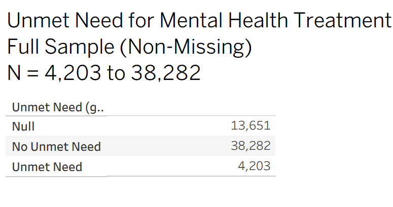
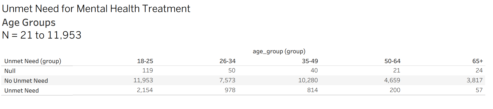
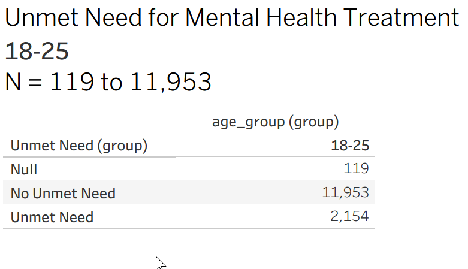
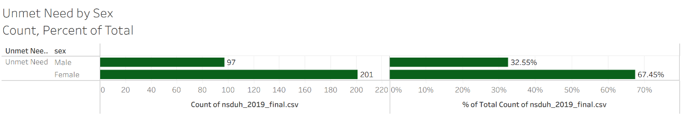
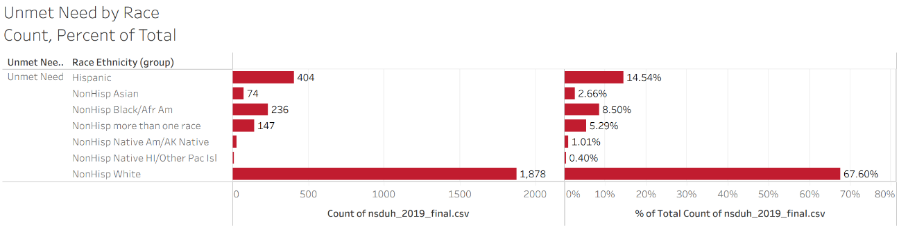
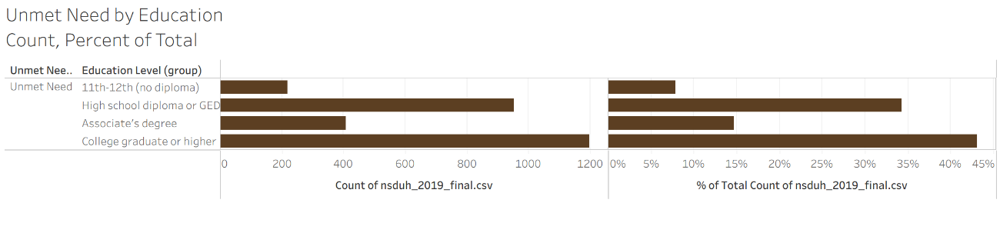
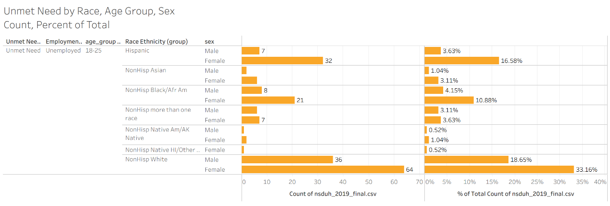

# sql_mini_mentalhealth
# Unmet Mental Health Need and Employment Outcomes

**Mini SQL Project | Data Sources: NSDUH (2019–2023)**

[](https://www.postgresql.org/)
[](https://en.wikipedia.org/wiki/SQL)
[](https://www.tableau.com/)


---

## Executive Summary

> **Key Insight:** Analysis of NSDUH data reveals a statistically significant correlation between unmet mental health needs and workforce detachment. Identifying and treating these unmet needs presents a measurable opportunity for improving workforce retention and economic productivity.

**TL;DR:**
*   **Goal:** Determine if untreated mental health issues predict unemployment.
*   **Data:** 5 years of National Survey on Drug Use and Health (NSDUH) data (n > 200,000).
*   **Method:** SQL-based ETL pipeline, statistical hypothesis testing (Chi-Square), and Tableau visualization.
*   **Result:** **Significant Association.** Adults with unmet needs are disproportionately unemployed or out of the labor force, even when controlling for education.

---

## Table of Contents

1.  [Executive Summary](#executive-summary)
2.  [Project Overview](#project-overview)
    *   [Rationale](#rationale)
    *   [Summary](#summary)
    *   [Business Impact & Policy Implications](#business-impact--policy-implications)
3.  [Hypotheses](#hypotheses)
    *   [Primary Hypothesis (NSDUH)](#primary-hypothesis-nsduh)
    *   [Secondary Hypothesis (TEDS-A)](#secondary-hypothesis-teds-a)
    *   [Integrated Cross-Dataset Hypothesis](#integrated-cross-dataset-hypothesis)
    *   [Formal Hypothesis](#formal-hypothesis)
4.  [Data Source: The NSDUH Study](#data-source-the-nsduh-study)
    *   [The Gold Standard](#the-gold-standard-for-behavioral-health-data)
    *   [Navigating Signal vs. Noise](#navigating-signal-vs-noise)
    *   [Extraction Strategy](#extraction-strategy)
    *   [Defining "Unmet Need"](#defining-unmet-need)
5.  [Methodology & Phases](#methodology--phases)
    *   [Project Structure](#project-structure)
    *   [Phase 1 – NSDUH 2019](#phase-1--nsduh-2019-current-stage)
    *   [Phase 2 – Multi-Year NSDUH Integration](#phase-2--multi-year-nsduh-integration-20202023)
    *   [Phase 3 – TEDS Integration](#phase-3--teds-integration-future-phase)
6.  [ETL & Data Engineering](#etl--data-engineering)
    *   [ETL Documentation](#etl-documentation)
    *   [Data Refinement and Table Standardization](#data-refinement-and-table-standardization-20192023)
    *   [Variable Recoding & Renaming](#phase-1--nsduh-2019-current-stage)
    *   [Data Type Enforcement](#data-type-enforcement)
    *   [Import Verification](#import-verification)
    *   [Technical Highlights](#technical-highlights)
7.  [Analysis & Findings](#analysis--findings)
    *   [Key Findings 2019](#key-findings-2019_nsduh)
    *   [Exploratory Data Analysis](#exploratory-data-analysis)
    *   [Demographics](#demographics)
    *   [Employment Status](#employment-status)
    *   [Interpretation of Preliminary Findings](#interpretation-of-preliminary-findings)
8.  [Discussion & Recommendations](#discussion--recommendations)
    *   [Recommendations for Further Action](#recommendations-for-further-action-and-study)
    *   [Note on Unmet Need vs Workplace Access](#note-why-access-at-work-is-not-included-in-unmet-need)
9. [Future Roadmap: Phase 3 (TEDS-A)](#future-roadmap-phase-3-teds-a)
    *   [Secondary Hypothesis](#secondary-hypothesis-teds-a)
    *   [Integrated Analysis](#integrated-cross-dataset-hypothesis)

---

## Project Overview

### Rationale

This project builds on a long-standing engagement with mental health, informed by professional experience in treatment settings, formal training in psychology, and previously published work with a major publisher (Atria / Beyond Words, 2009/2018) on addiction and mental health. Subsequent publications included a non-fiction public health book based on an academic literature review of neurophysiology and addiction. Early work drew on SAMHSA datasets to explore recovery-related questions, establishing both familiarity with federal behavioral-health data and a track record of translating complex public-health information for broad audiences.

With a transition into data analytics and a growing focus on the healthcare vertical, the need was obvious to revisit these datasets from a new perspective—one that integrates domain knowledge with modern analytical tooling. The guiding objective was to identify a question that is both substantively meaningful and analytically strong enough to showcase technical skill.

Through a review of available SAMHSA surveys and exploratory inquiry into underexamined areas, one relationship emerged as especially relevant to employers and policymakers: whether unmet mental-health need is associated with weaker employment outcomes. NSDUH offers a large, scientifically rigorous sample well suited to investigating this relationship.

From the full 2,741-variable NSDUH file, a targeted subset of fields was manually isolated in Excel, exported to CSV, and imported into PostgreSQL for structured cleaning and schema alignment. Subsequent preparation steps, harmonization, and analytic workflows are documented in later sections of this README.

### Summary

This SQL-based mini study combines NSDUH population survey data with TEDS-A treatment admissions data to explore how unmet or untreated mental health needs relate to workforce detachment. The analysis demonstrates ETL workflow clarity, SQL analytic structure, and workforce policy relevance through hypothesis-driven modeling across multiple federal datasets.

*Draft Note (Variant):* This SQL-based mini study ultimately (Phase 3) combines NSDUH population survey data with TEDS-A treatment admissions data to explore how unmet or untreated mental health needs relate to workforce detachment. The analysis demonstrates ETL workflow clarity, SQL analytic structure, and workforce policy relevance through hypothesis-driven modeling across multiple federal datasets.

### Business Impact & Policy Implications

**TL;DR: Mental health is an economic engine.**
*   **Workforce Retention:** Untreated mental health issues are a "silent leak" in the labor force.
*   **ROI of Care:** Data suggests that barriers to access (cost, stigma) have direct economic consequences.
*   **Strategic Policy:** Employers establishing Assistance Programs (EAPs) could see measurable ROI in retention.

-   Workforce mental health loss is measurable through unmet need and co-occurring disorder prevalence across *systems, verticals and industries*
-   Quantifying this link supports business HR and social economic policy, treatment funding, and workforce retention strategies
-   Establishing reproducible SQL and ETL workflows provides a transparent foundation for integrated behavioral health analytics and further study.
-   There are many questions left to explore, validate or invalidate in this repo. Please contribute your own branch of analysis!

---

## Hypotheses

### Primary Hypothesis (NSDUH)

Adults reporting unmet need for mental health treatment have higher odds of being unemployed or out of the labor force than adults without unmet need, controlling for age, sex, race/ethnicity, and education.

**Operationalization (NSDUH):**

-   **Exposure:** `AMHTXND2 = 1` (unmet need for mental health treatment in past 12 months)
-   **Outcome:** `IRWRKSTAT ∈ {Unemployed, Not in labor force}`
-   **Covariates:** `AGE2`, `IRSEX`, `NEWRACE2`, `IREDUHIGHST2`, survey weights (`ANALWT_C`), design (`VESTR`, `VEREP`)
-   **Estimand:** Adjusted odds ratio of unemployment/OLF comparing `AMHTXND2=1` vs `0`

### Formal Hypothesis

Adults who report an unmet need for mental health treatment are more likely to be unemployed. being unemployed or out of the labor force than adults without unmet need, controlling for age, sex, race/ethnicity, and education.

*Primary Hypothesis (NSDUH only):* Unmet need Access, or unmet need for mental health services predicts employment status. We ask if lack of access to mental health care affects one’s ability to maintain employment, and what groups show the highest unmet need.

---

## Data Source: The NSDUH Study

### **The Gold Standard for Behavioral Health Data**
The **National Survey on Drug Use and Health (NSDUH)** is the primary source of statistical information on the use of illicit drugs, alcohol, and tobacco in the U.S. civilian, non-institutionalized population aged 12 and older. Conducted annually by the Substance Abuse and Mental Health Services Administration (SAMHSA), this study provides a crucial, nationally representative window into the intersection of mental health, substance use, and socioeconomic status.

### **Navigating Signal vs. Noise**
The NSDUH public-use files are massive, containing **2,741 distinct variables** per year. This complexity presents a significant data engineering challenge: distinguishing between similar-sounding variables (e.g., "received treatment" vs. "perceived unmet need" vs. "needed but did not receive treatment") requires deep domain expertise.

### **Extraction Strategy**
Rather than ingesting the full wide-format dataset, we executed a targeted **manual extraction strategy**:
1.  **Variable Isolation**: We audited the 2,741-variable schema to effectively isolate the <15 key fields that drive our specific hypothesis.
2.  **Harmonization**: We traced these specific variable codes (`AMHTXND2`, `IRWRKSTAT`, etc.) across five years of data (2019-2023) to account for schema drift and changing definitions.
3.  **ETL Pipeline**: These targeted subsets were exported to CSV and ingested into PostgreSQL, ensuring our analytics run on a clean, optimized schema rather than a bloated raw file.

### **Defining "Unmet Need"**
Our primary exposure variable, `AMHTXND2`, is not a simple "Yes/No" question. It is a derived variable constructed from a complex logic tree of survey questions:
*   *"During the past 12 months, was there any time when you needed mental health treatment or counseling for yourself but didn’t get it?"*
*   Follow-up probes regarding specific barriers (cost, stigma, access).
*   verification against service utilization records.

This rigorous definition ensures that when we measure "unmet need," we are capturing a validated signal of healthcare disparity, not just casual sentiment.

---

## Methodology & Phases

### Project Structure

| **Stage** | **Objective** | **Output** |
| :--- | :--- | :--- |
| Ask / Plan | Define hypotheses, outcomes, covariates | Operational definitions |
| Prepare | Import, rename, validate datasets, address schema drift, variable consistency, null values, data types. | Clean PostgreSQL tables |
| Process / Analyze | NSDUH, Phase 1, TEDS-A, Phase 2-3<br>Frequency and Distribution, Descriptive Statistica, Chi-Square, Phase 3 Logistic regressions | Adjusted odds ratios |
| Construct / Share | Export CSVs to Tableau | Dashboards and reports |
| Execute / Act | Present findings | Executive brief, Full PDF publication and a short video presentation |

### Phase 1 – NSDUH 2019 (current stage)

*Recoding variables for clarity is detailed in the ETL section.*

#### Phase 2 – Multi-Year NSDUH Integration (2020–2023)

After 2019 is complete, identical transformations will be applied to the 2020–2023 files. These later years introduce schema drift, including *schema drift*, changes in:

-   Employment status coding
-   Missing/unavailable variables
-   Unmet-need measurement shifting to three mental-health service variables (2022–2023)
-   Those differences are *not* handled here; they are handled in Phase 2.

---

## ETL & Data Engineering

### ETL Documentation

#### Extract
Documented PowerShell commands and SQL scripts used to import and harmonize NSDUH (2019–2023) and TEDS-A (2019–2022) into PostgreSQL. (See: `/docs/etl_nsduh_teds.docx`)

Data Sources: NSDUH (2019–2023) and TEDS-A (2019–2022)

#### Transform
Pending implementation. Will include SQL queries for cleaning, joining, and structuring tables by variable categories (mental health indicators, productivity, demographics).

#### Load
Pending. Will document PostgreSQL load process for analysis-ready schema.

### Data Refinement and Table Standardization (2019–2023)

**Overview:** Extended multi-year integration through 2023 for NSDUH and TEDS-A using raw SAMHSA public-use tab files. For each year, extracted only required headers in Excel, saved CSV subsets, imported to PostgreSQL, then applied readable column names for consistent schemas across years.

**Workflow Summary (per year, per dataset):**
1. Open raw `.tab` file in Excel.
2. Use header filter to locate required variables.
3. Copy only required columns into a clean worksheet.
4. Save as `*_YYYY_subset.csv` (UTF-8, comma-delimited).
5. In pgAdmin: create target table → Import CSV (Header = Yes, Delimiter = Comma, Encoding = UTF8).
6. Validate import:
```sql
SELECT COUNT(*) FROM table_name;
SELECT * FROM table_name LIMIT 10;
```

**Variables Extracted:**
*   **NSDUH (2019–2023)**: `AMHTXND2`, `IRWRKSTAT`, `AGE2/CATAGE` (year-specific), `IRSEX`, `NEWRACE2`, `IREDUHIGHST2`, `FILEDATE`, `ANALWT_C`, `VESTR` (year-specific), `VEREP`

**Exact headers used by year:**

| Year | Age field | Weight field | Stratum field | Replicate field |
| :--- | :--- | :--- | :--- | :--- |
| 2019 | AGE2 | ANALWT_C | VESTR | VEREP |
| 2020 | AGE2 | ANALWT_C | VESTR | VEREP |
| 2021 | CATAGE | ANALWT_C | VESTR | VEREP |
| 2022 | CATAGE | ANALWT_C | VESTR | VEREP |
| 2023 | CATAGE | ANALWT_C | VESTR | VEREP |

**Header normalization and readable renames (applied after import):**

*2019–2020*
- AGE2 → age_group
- ANALWT_C → person_weight
- VESTR → variance_stratum
- VEREP → variance_replicate

*2021–2023*
- CATAGE → AGE2
- AGE2 → age_group
- ANALWT_C → person_weight
- VESTR → variance_stratum
- VEREP → variance_replicate

#### Recoding Variables for Clarity

| Original | Renamed | Description |
| :--- | :--- | :--- |
| AMHTXND2 | unmet_need | Unmet need for mental health treatment (past 12 months) |
| IRWRKSTAT | employment_status | Employment status (employed / unemployed / not in labor force) |
| AGE2 / CATAGE | age_group | Age category (normalized across years) |
| IRSEX | sex | Sex |
| NEWRACE2 | race_ethnicity | Race/ethnicity (combined) |
| IREDUHIGHST2 | education_level | Highest education level |
| FILEDATE | survey_date | Record/survey date |
| ANALWT_C | person_weight | Person-level survey weight |
| VESTR | variance_stratum | Variance estimation stratum |
| VEREP | variance_replicate | Variance replicate |

*TEDS-A (2019–2022)*
| Original | Renamed | Description |
| :--- | :--- | :--- |
| ADM_YR | admission_year | Admission year |
| CASEID | case_id | Admission identifier |
| STFIPS | state_fips | State FIPS |
| EMPLOY | employment_status | Employment status at admission |
| PSYPROB | mental_health_problem | Co-occurring mental health problem |
| AGE | age_group | Age group at admission |
| SEX | sex | Sex |
| RACE | race | Race |
| ETHNIC | ethnicity | Ethnicity (Hispanic origin) |
| EDUC | education_level | Highest education attained |
| DIVISION | census_division | U.S. Census division |
| REGION | census_region | U.S. Census region |

#### SQL Examples (Data Refinement)

*NSDUH example (2021 normalization + rename):*
```sql
/* ============================================================
   Normalize 2021 age header, then apply readable column names
   Dataset: NSDUH 2021
   ============================================================ */

-- Step 1: Normalize age header
ALTER TABLE nsduh_2021
RENAME COLUMN catage TO age2;

-- Step 2: Apply readable, analysis-ready column names
ALTER TABLE nsduh_2021
    RENAME COLUMN amhtxnd2        TO unmet_need,
    RENAME COLUMN irwrkstat       TO employment_status,
    RENAME COLUMN age2            TO age_group,
    RENAME COLUMN irsex           TO sex,
    RENAME COLUMN newrace2        TO race_ethnicity,
    RENAME COLUMN ireduhighst2    TO education_level,
    RENAME COLUMN filedate        TO survey_date,
    RENAME COLUMN analwt_c        TO person_weight,
    RENAME COLUMN vestr           TO variance_stratum,
    RENAME COLUMN verep           TO variance_replicate;
```

*Handling Schema Drift (2022-2023 Unmet Need Calculation):*
```sql
-- Create new nsduh_2022 table based on nsduh_2022_raw table, with calculated unmet_need
CREATE TABLE nsduh_2022 AS
SELECT
    CASE
-- no treatment + either shelter tx or skilled therapy → unmet need = 1
        WHEN mhtrtpy = 1 THEN 0
-- no treatment + no shelter tx + no skilled therapy → unmet need = 0
        WHEN mhtrtpy = 0 AND (mhtshldtx = 1 OR mhtskthpy = 1) THEN 1
        WHEN mhtrtpy = 0
             AND COALESCE(mhtshldtx, 2) IN (0, 2)
             AND COALESCE(mhtskthpy, 2) IN (0, 2) THEN 0
-- everything else → null
        ELSE NULL
-- keep only unmet_need_revised, not the three cols it was derived from
    END AS unmet_need_revised,
    irwrkstat,
    age2,
-- ... (other columns)
    verep
FROM nsduh_2022_raw;
```

#### Data Type Enforcement
(Addressing Merge Conflicts in Data Types Table)

| Column Name | Data Type | Usage & Consistency Work |
| :--- | :--- | :--- |
| unmet_need | INTEGER | Always recoded to integer codes for analysis. |
| employment_status | INTEGER | Integer codes (standardized mappings if categories changed). |
| age_group | INTEGER | Categorical bins, ensure integer representation. |
| sex | INTEGER | Categorical, integer assignment; newer years may use sex assigned at birth, map to same codes. |
| race_ethnicity | INTEGER | Integer-based bins; if categories changed or expanded, recode to stable codes across years. |
| education_level | INTEGER | Integer codes for attainment or years. Recode if category bins shifted in newer years. |
| survey_date | DATE | ISO date format (YYYY-MM-DD) for robust Tableau processing. |
| person_weight | NUMERIC | Floating point or double precision is valid; use numeric for consistency. |
| variance_stratum | INTEGER | Remains integer in all years, used for design analysis. |
| variance_replicate | INTEGER | Remains integer in all years, used for design analysis. |

*SQL for Data Type Conversion:*
```sql
ALTER TABLE nsduh_2019
    ALTER COLUMN survey_date TYPE date
    USING to_date(survey_date, 'MM/DD/YYYY');
-- ... (Repeated for other years)

-- Enforce data types for analysis due to methodology changes in 2022, 2023.
ALTER TABLE nsduh_2019
    ALTER COLUMN unmet_need         TYPE integer,
    ALTER COLUMN employment_status  TYPE integer,
    ALTER COLUMN age_group          TYPE integer,
    ALTER COLUMN sex                TYPE integer,
    ALTER COLUMN race_ethnicity     TYPE integer,
    ALTER COLUMN education_level    TYPE integer,
    ALTER COLUMN survey_date        TYPE date,
    ALTER COLUMN person_weight      TYPE numeric,
    ALTER COLUMN variance_stratum   TYPE integer,
    ALTER COLUMN variance_replicate TYPE integer;
```

#### Import Verification
```sql
SELECT table_name, column_name, data_type
FROM information_schema.columns
WHERE table_schema='public'
AND table_name IN ('nsduh_2019', 'nsduh_2020', 'nsduh_2021', 'nsduh_2022', 'nsduh_2023', 'teds_a_2019', 'teds_a_2020', 'teds_a_2021', 'teds_a_2022', 'teds_a_2023')
ORDER BY table_name, ordinal_position;
```

---

## Technical Highlights

**TL;DR:** This project demonstrates advanced SQL capabilities including complex data harmonizing, derived variable construction, and cross-year schema mapping.

### 1. Complex Logic for "Unmet Need"
The `unmet_need` variable isn't a simple column; it required harmonizing logic across years where definitions shifted.

```sql
-- Derived Variable Construction
CASE
    -- Scenario A: No treatment, but sought shelter/specialized therapy -> Unmet Need
    WHEN mhtrtpy = 0 AND (mhtshldtx = 1 OR mhtskthpy = 1) THEN 1
    
    -- Scenario B: No treatment, no access attempts -> No Unmet Need
    WHEN mhtrtpy = 0 
         AND COALESCE(mhtshldtx, 2) IN (0, 2) 
         AND COALESCE(mhtskthpy, 2) IN (0, 2) THEN 0
         
    ELSE NULL
END AS unmet_need_revised
```

### 2. Schema Drift Handling
Managed schema evolution across 5 years of federal data releases (2019-2023), mapping changing column names (e.g., `AGE2` vs `CATAGE`) and data types to a unified PostgreSQL schema.

---

## Analysis & Findings

### Key Findings 2019_nsduh

#### Exploratory Data Analysis
Summary statistics were gathered on a subset of self-reported unmet need by age, race, sex, education level.

### Frequencies, Counts and Percent of Total
**Define the populations:**
*   Overall sample (all ages, full NSDUH 2019 analytic set)
    
    

### Demographics

**Age-groups (excludes under 18):**


**Focus age group:**

Because 18–25-year-olds account for the largest share of unmet-need cases in the full sample, all subsequent subgroup analyses focus on respondents aged 18–25 with unmet need.
**

**Sex:**

Within 18-25 with unmet need, females dominate males in terms of reporting unmet mental health need. However, this finding is misleading. As shown below, a higher *within-group %* for females can coexist with males showing the strongest relationship in a chi-square output, because chi-square is driven by **how far each cell is from its expected count**, not by which group has the bigger row percentage.

**Race/Ethnicity:**

Within 18-25 with unmet need, whites dominate other races in terms of reporting unmet mental health need.

**Education level:**

Within 18-25 with unmet need, college graduates dominate lower education levels in terms of reporting unmet mental health need.

### Employment Status
Within 18-25 with unmet need, employed (full time or part time) dominates unemployed in terms of reporting unmet mental health need.


*Among 18–25-year-olds with unmet need, white females account for the largest share of unmet-need cases.*

### Interpretation of Preliminary Findings

**1. The Hidden Story / Connection to Chi-Square**
A higher *within-group %* for females can coexist with males showing the “strongest relationship” in a chi-square output, because chi-square is driven by **how far each cell is from its expected count**, not by which group has the bigger row percentage.

The demographic burden charts for 18–25 with unmet need are the descriptive slice of those tables, restricted to the “Unmet need = Yes” column and normalized by $$N_{\text{unmet} , 18 \text{–} 25}$$.

*   Steps 1–2 justify focusing on age 18–25.
*   Step 3 defines the analytic population going forward: age 18–25 with unmet need.
*   Steps 4–6 identify, for each demographic, who dominates the unmet-need burden inside that population.
*   The chi-square results then test whether unmet need is statistically associated with those demographic variables across 18–25-year-olds.

**2. Modeling Challenges**
The first attempted logistic regression failed because both predictors—unmet need and employment status—were coded as categorical integers with no underlying continuous scale. Treating category labels as numeric produced an artificial Pearson correlation of **0.13**, a *meaningless* value.

Phase Three will fix this by using a **multinomial logistic regression** with unmet need as the categorical outcome variable and employment status, age group, sex, race, ethnicity, and education as categorical predictors.

**3. Contingency Table Analysis**
| | Full-time | Part-time | Unemployed |
| :--- | :--- | :--- | :--- |
| No Unmet Need | 9050 | 3467 | 969 |
| Unmet Need | 1402 | 691 | 201 |

*Interpretation:*
• When people do not have unmet need, most are in full-time work.
• When people do have unmet need, the rate of unemployment and part-time work increases relative to their group size.

**4. Percent-of-row vs percent-of-column confusion**
*   **Percent of Total:** Expresses each cell as a percent of *all people combined*. Dilutes the signal because full-time workers dominate.
*   **Percent of Row:** Expresses percentages *within unmet-need groups*. This is the correct view.

Using row percentages:
*   **No Unmet Need**: Full-time ~67%
*   **Unmet Need**: Full-time ~61%
*   **Pattern**: As unmet need appears, **full-time drops**, **part-time rises**, **unemployment rises**.

**5. Chi-square meaning in our context**
The chi-square test checks whether the distribution across employment categories is statistically different between unmet-need groups.
Therefore: **Reject the null hypothesis.** Employment status is not independent of unmet mental-health need.

**6. Conclusion**
Our Tableau results show a **statistically significant and practically meaningful association** between unmet mental-health need and worse employment outcomes, supporting our hypothesis that mental-health status relates to productivity measures.

---

## Discussion & Recommendations

### Recommendations for further action and study.

**-- Create clean binary variable for workplace assistance program access**
```sql
CASE
    WHEN wrkdrghlp = 1 THEN 1        -- Yes, EAP or counseling available
    WHEN wrkdrghlp = 2 THEN 0        -- No, not offered
    ELSE NULL                        -- All missing, skips, DK, refused, bad data
END AS employer_assistance_program
```

This aligns `WRKDRGHLP` with `unmet_need`, `employment_status`, etc.
Now you can model things like: “Does access to an employer assistance program predict lower unmet need or higher employment?”

### Note: Why access at work is NOT included in unmet need

Unmet need in NSDUH is defined strictly as: "**The respondent needed mental health treatment in the past 12 months but did not get it.**"

This is calculated from treatment-need questions and service-use questions only. The formula does **not** use:
*   whether the workplace offered assistance
*   whether the respondent knew about the assistance
*   insurance access
*   ability to pay
*   stigma
*   employer support / benefits / EAP availability

**Why unmet need CANNOT include workplace access:**
Because access is only one potential barrier among many. Unmet need is a self-reported mental health outcome, not an environmental variable.

Follow-up reasons for not receiving treatment include:
*   didn’t think treatment would help
*   cost
*   didn’t know where to go
*   couldn’t get an appointment
*   transportation barriers
*   fear, stigma, privacy concerns
*   time constraints
*   didn’t want records

But they do **not** include: “Does your employer offer an EAP?”
Because NSDUH does not tie unmet need to employer benefits in its scoring or weighting.

**Summary:**
Unmet need is a mental-health outcome. Workplace access is an environmental exposure. They are not combined, not weighted together, and never influence each other inside NSDUH’s scoring. For this reason, workplace access is not already included in unmet need, even in weighted form.

---

## Future Roadmap: Phase 3 (TEDS-A)

### Secondary Hypothesis (TEDS-A)

Among treatment admissions, clients with a reported mental health problem have higher odds of being unemployed or not in the labor force at admission than clients without a reported mental health problem.

**Operationalization (TEDS-A 2019–2022):**

-   **Exposure:** `PSYPROB = 1` (co-occurring mental health problem)
-   **Outcome:** `EMPLOY ∈ {Unemployed, Not in labor force}`
-   **Covariates:** `AGE` (categorical), `SEX`, `RACE/ETHNIC`, `EDUC`, state (`STFIPS`), year
-   **Estimand:** Adjusted odds ratio of unemployment/OLF comparing `PSYPROB=1` vs `0`

### Integrated Cross-Dataset Hypothesis

Signals of unmet or untreated mental health need (`NSDUH AMHTXND2=1`) at the population level correspond with higher unemployment/OLF at point-of-treatment (`TEDS-A PSYPROB=1`), i.e., counties/years with higher NSDUH unmet-need prevalence will show higher shares of unemployed/OLF status among TEDS-A admissions, after adjusting for demographics and year.
